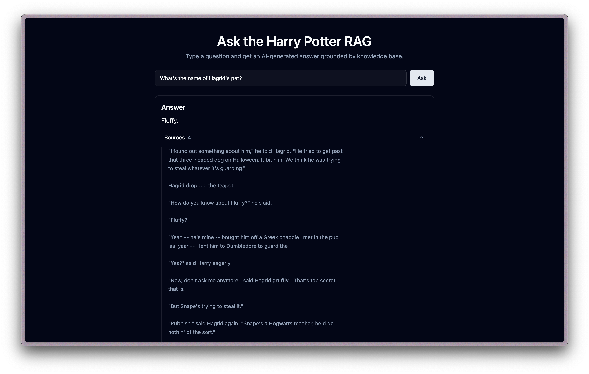

# Harry Potter RAG



A Retrieval-Augmented Generation (RAG) application that allows users to ask questions about the Harry Potter universe and receive AI-generated answers based on a comprehensive knowledge base.

## 🧙‍♂️ What is this?

This is an intelligent question-answering system specifically designed for Harry Potter content. It combines:

- **Vector Search**: Uses Qdrant vector database to find relevant information
- **AI Generation**: Leverages OpenAI's GPT models to generate contextual answers
- **Knowledge Base**: Built on a curated collection of Harry Potter content

## ✨ Features

- **Smart Q&A**: Ask any question about Harry Potter characters, events, spells, or lore
- **Source Citations**: View the specific sources used to generate each answer
- **Modern UI**: Clean, responsive interface built with SvelteKit and Tailwind CSS
- **Real-time Search**: Get instant answers with relevant context

## 🏗️ Architecture

The application consists of:

- **Frontend**: SvelteKit web application with modern UI components
- **Backend**: API endpoints for handling RAG queries
- **Vector Database**: Qdrant for semantic search and retrieval
- **AI Models**: OpenAI GPT for answer generation and text embeddings

## 🚀 Getting Started

### Prerequisites

- Node.js (v18 or higher)
- Bun package manager
- OpenAI API key
- Qdrant vector database instance

### Environment Variables

Create a `.env` file in the `webapp` directory with:

```bash
OPENAI_API_KEY=your_openai_api_key_here
QDRANT_INSTANCE_URL=your_qdrant_url_here
QDRANT_COLLECTION=your_collection_name
QDRANT_API_KEY=your_qdrant_api_key_here  # Optional
```

### Installation

1. Clone the repository:

```bash
git clone <repository-url>
cd Harry-potter-RAG
```

2. Install dependencies:

```bash
cd webapp
bun install
```

3. Start the development server:

```bash
bun run dev
```

4. Open your browser and navigate to `http://localhost:5173`

## 🎯 Usage

1. **Ask a Question**: Type any Harry Potter-related question in the input field
2. **Get Answers**: Receive AI-generated responses based on the knowledge base
3. **View Sources**: Click on "Sources" to see the specific content used to generate the answer

### Example Questions

- "What is the significance of the Deathly Hallows?"
- "How does Harry defeat Voldemort in the final battle?"
- "What are the four Hogwarts houses and their characteristics?"
- "Explain the relationship between Snape and Lily Potter"

## 🛠️ Technology Stack

- **Frontend**: SvelteKit, Tailwind CSS, TypeScript
- **AI/ML**: LlamaIndex, OpenAI GPT, OpenAI Embeddings
- **Database**: Qdrant Vector Database
- **Build Tools**: Vite, Bun
- **UI Components**: Bits UI, Lucide Icons

## 📁 Project Structure

```
Harry-potter-RAG/
├── webapp/                 # Main SvelteKit application
│   ├── src/
│   │   ├── routes/        # API endpoints and pages
│   │   ├── lib/           # Utility functions and components
│   │   └── app.html       # Main HTML template
│   ├── package.json       # Dependencies and scripts
│   └── vite.config.ts     # Vite configuration
└── README.md              # This file
```

## 🔧 Development

### Available Scripts

- `bun run dev` - Start development server
- `bun run build` - Build for production
- `bun run preview` - Preview production build
- `bun run check` - Type checking
- `bun run format` - Format code with Prettier
- `bun run lint` - Lint code with ESLint

### Code Quality

The project uses:

- **TypeScript** for type safety
- **ESLint** for code linting
- **Prettier** for code formatting
- **SvelteKit** for modern web development

## 🤝 Contributing

1. Fork the repository
2. Create a feature branch
3. Make your changes
4. Add tests if applicable
5. Submit a pull request

## 📝 License

This project is open source and available under the [MIT License](LICENSE).

## 🙏 Acknowledgments

- J.K. Rowling for creating the Harry Potter universe
- OpenAI for providing the AI models
- The SvelteKit and Tailwind CSS communities
- LlamaIndex for the RAG framework

---

**Note**: This application is for educational and entertainment purposes. All Harry Potter content and characters belong to their respective owners.
